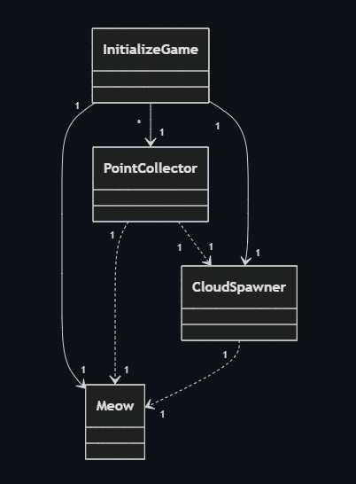
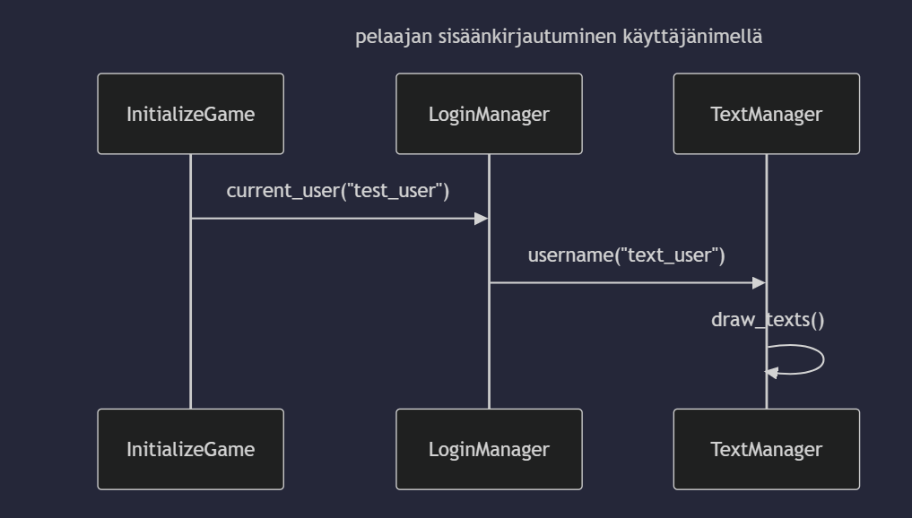

# Arkkitehtuurikuvaus
## Rakenne
Ohjelman rakenne koostuu kokonaisuudessaan yhdeksästä luokasta. Luokista tärkein on [InitializeGame](https://github.com/neakovalainen/ohjelmistotekniikka25/blob/ad416730b96ab3a2d80a6573912a8376b66fa2ce/cloudleap/src/index.py#L15), joka pitää huolen pelin käynnistymisestä, pyörimisestä ja sulkemisesta. \
Luokka [TextManager](https://github.com/neakovalainen/ohjelmistotekniikka25/blob/ad416730b96ab3a2d80a6573912a8376b66fa2ce/cloudleap/src/textmanager.py#L9) hoitaa käyttöliittymän tekstien piirtämisen ja päivittämisen, sekä nappien toiminnallisuuden.\
Pelin objektit sijaitsevat tiedostossa objects.py, joka sisältää luokat [Meow](https://github.com/neakovalainen/ohjelmistotekniikka25/blob/ad416730b96ab3a2d80a6573912a8376b66fa2ce/cloudleap/src/objects.py#L10), [PointCollector](https://github.com/neakovalainen/ohjelmistotekniikka25/blob/ad416730b96ab3a2d80a6573912a8376b66fa2ce/cloudleap/src/objects.py#L68), [CloudSpawner](https://github.com/neakovalainen/ohjelmistotekniikka25/blob/ad416730b96ab3a2d80a6573912a8376b66fa2ce/cloudleap/src/objects.py#L144), sekä [MinusEnergy](https://github.com/neakovalainen/ohjelmistotekniikka25/blob/ad416730b96ab3a2d80a6573912a8376b66fa2ce/cloudleap/src/objects.py#L203). \
Näiden yllämainittujen luokkien lisäksi ovat luokat [UserData](https://github.com/neakovalainen/ohjelmistotekniikka25/blob/ad416730b96ab3a2d80a6573912a8376b66fa2ce/cloudleap/src/userdata.py#L1), joka hoitaa sql kyselyt liittyen käyttäjän dataan, [LogInManager](https://github.com/neakovalainen/ohjelmistotekniikka25/blob/ad416730b96ab3a2d80a6573912a8376b66fa2ce/cloudleap/src/shared_resources.py#L1), joka hoitaa sisään- ja uloskirjautumisen, sekä [GameStatus](https://github.com/neakovalainen/ohjelmistotekniikka25/blob/ad416730b96ab3a2d80a6573912a8376b66fa2ce/cloudleap/src/shared_resources.py#L15), joka helpottaa pelin statuksen seuraamista. \
Viimeinen luokka on [GameOver](https://github.com/neakovalainen/ohjelmistotekniikka25/blob/ad416730b96ab3a2d80a6573912a8376b66fa2ce/cloudleap/src/game_over.py#L3), jota käytetään vain siinä tilanteessa, jossa pelaaja on hävinnyt pelin. Tämän luokan tehtävänä on piirtää näytölle game over ilmoitus.\
Alla oleva luokkakaavio kuvaa luokan InitializeGame ja objekteja hoitavien luokkien välisiä riippuvuuksia.
\
\


## Käyttöliittymä
Pelin käyttöliittymä on hyvin yksinkertainen. Siinä on periaatteessa kolme näkymää: \
- aloitusnäkymä
- pelinäkymä
- pelin lopetusnäkymä

Aloitus, ja pelinäkymässä on paljon samaa, mutta niissä olevat tekstit eroavat hieman toisistaan. Ennen kun peli on aloitettu, näkyy käyttäjälle kirajutumiseen tarvittavat ohjeet ja välkkyvä cursori, kun taas pelin alettua ne katoavat ja näkyviin tulee ohje miten käynnistää peli. \
Lopetusnäkymä on näistä kahdesta erillinen. Siinä näkyy pelaajan pisteet, ja ohjeet miten aloittaa uudestaan. 
 
## Sisäänkirjautuminen
Alla oleva sekvenssidiagrammi kuvaa sitä, miten sisäänkirjautuminen toimii. Näkyvien tapahtumien lisäksi InitializeGame kutsuu Luokkaa UserData, joka tallentaa käyttäjän, mikäli sitä ei ole olemassa.


## Tietojen tallentaminen
Tietojen tallentaminen tapahtuu SQLite-tietokantaan. Tietokannan voi tyhjentää ja alustaa uudelleen pyörittämällä komennon: \
``` python3 src/build.py ```  \
Jos siis haluaa, että oma käyttäjä ja suoritus on tallessa, tulee uudelleenkäynnistäessä pyörittää pelkästään: \
```poetry run invoke start```  