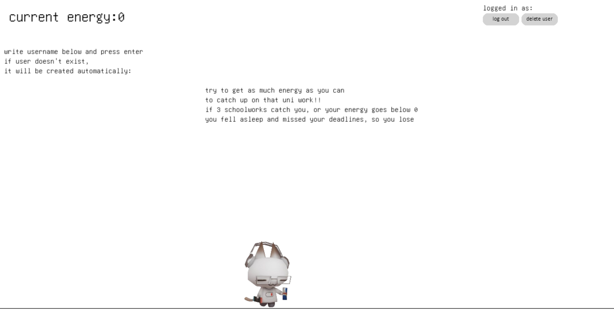
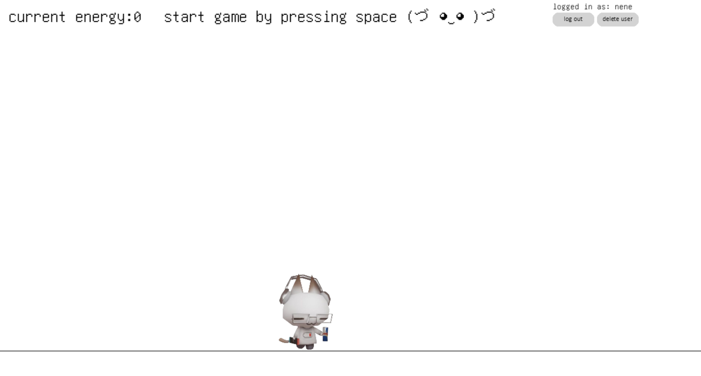
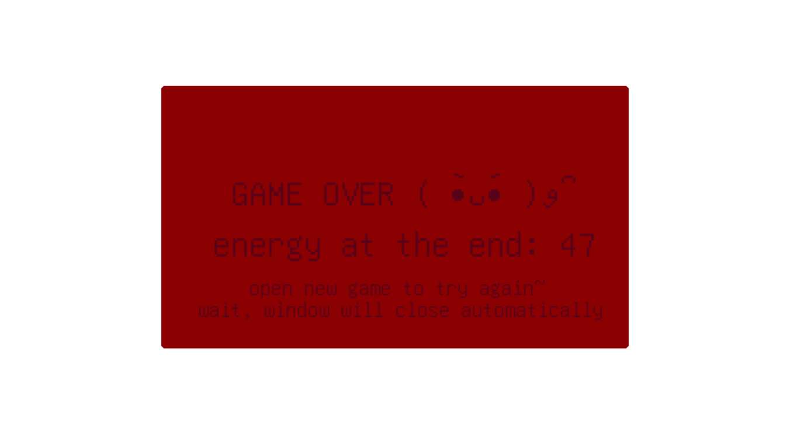

# Käyttöohjeet
## Projektin käynnistäminen
1. Kun peli on ladattu koneelle, tulee ensiksi sen riippuvuudet ladata komennolla: \
```poetry install``` 
2. Peli käyttää tietokantaa, jonka saa alustettua komennolla: \
```python3 src/build```
3. Riippuvuuksien lataudutta voi pelin käynnistää: \
```poetry invoke start```

## Käyttäjän luominen ja sisään kirjautuminen
Pelin käynnistyttyä tulisi käyttäjälle näkyä seuraava näkymä:
 

Käyttäjänimen voi kirjoittaa tekstirivin "it will be created automatically" alle. Painamalla enteriä kirjautuminen on tapahtunut. Mikäli käyttäjällä ei ole ennaltaan käyttäjää, luodaan se automaattisesti. \
Uloskirjautuminen tapahtuu painamalla log out nappulaa, joka tuo käyttäjän tähän samaan näkymään. Käyttäjän poistaminen tapahtuu delete user nappia painamalla, joka myös vie käyttäjän tähän näkymään. \
Sisäänkirjauduttua näkymä näyttää tältä:



Pelin ideana on kerätä enrgiajuomia mahdollisimman paljon. Niiden kerääminen nopeuttaa, ja täten vaikeuttaa peliä. Tietokoneita, jotka kuvaavat koulutöitä on välteltävä. Mikäli energiataso on 0 ja osuu yhteen, peli päättyy. Peli päättyy myös jos on osunut yhteensä kolmeen. 

Pelin päättymisen huomaa seuraavasta näkymästä:\


Kuten ruudulla lukee, peli sulkeutuu automaattisesti. Aloittaaksesi uuden, käynnistä peli uudelleen. Älä kuitenkaan alusta tietokantaa uudestaan, mikäli haluat nähdä edellisen suorituksesi.
