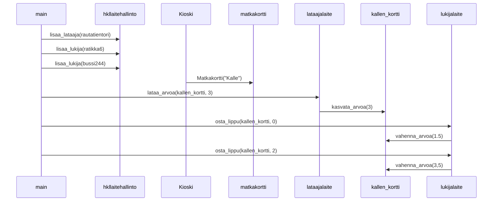

```mermaid
    sequenceDiagram
        main->>hkllaitehallinto: lisaa_lataaja(rautatientori)
        main->>hkllaitehallinto: lisaa_lukija(ratikka6)
        main->>hkllaitehallinto: lisaa_lukija(bussi244)
        Kioski->>matkakortti: Matkakortti("Kalle")
        main->>lataajalaite: lataa_arvoa(kallen_kortti, 3)
        lataajalaite->> kallen_kortti: kasvata_arvoa(3)
        main->>lukijalaite: osta_lippu(kallen_kortti, 0)
        lukijalaite->>kallen_kortti: vahenna_arvoa(1.5)
        main->>lukijalaite: osta_lippu(kallen_kortti, 2)
        lukijalaite->>kallen_kortti: vahenna_arvoa(3,5)

```