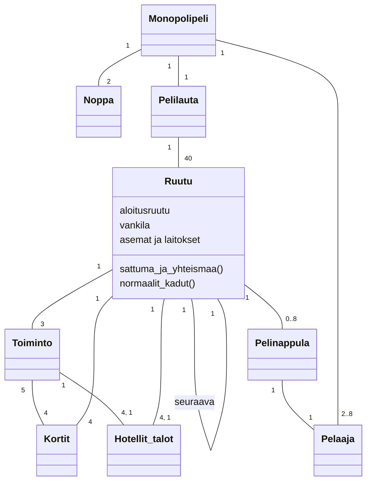

```mermaid
 classDiagram
    Monopolipeli "1" -- "2" Noppa
    Monopolipeli "1" -- "1" Pelilauta
    Pelilauta "1" -- "40" Ruutu
    class Ruutu{
        aloitusruutu
        vankila
        sattuma_ja_yhteismaa()
        asemat ja laitokset
        normaalit_kadut()
    }
    Ruutu "1" -- "3" Toiminto
    Toiminto "5" -- "4" Kortit
    Kortit "4" -- "1" Ruutu
    Toiminto "1" -- "4, 1" Hotellit_talot
    Hotellit_talot "4, 1" -- "1" Ruutu
    Ruutu "1" -- "1" Ruutu : seuraava
    Ruutu "1" -- "0..8" Pelinappula
    Pelinappula "1" -- "1" Pelaaja
    Pelaaja "2..8" -- "1" Monopolipeli
```